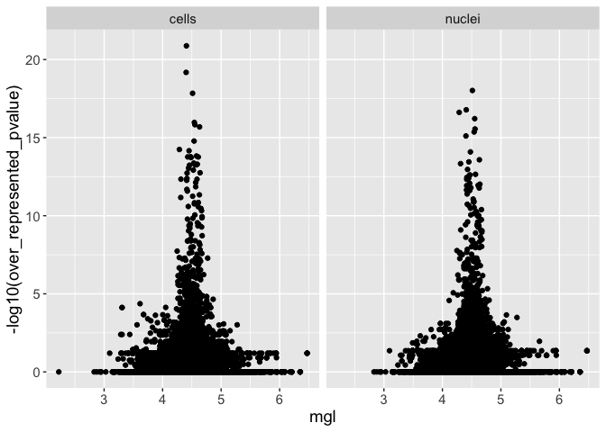

Sampling bias analysis final
================
John Chamberlin
2024/01/25

## R Markdown

``` r
# Yao et al-generated barcode annotations for AIBS V3 dataset
oriAnnot = data.table::fread("data/meta_brainatlas/cluster.annotation.cell.nuc.csv") %>% 
  filter(class_label != "Low Quality")

table(oriAnnot$tech) # 71K cells, 40K nuclei
```

    ## 
    ##  cells nuclei 
    ##  71183  40166

``` r
# import mouse genome annotation I used with STARsolo with additional features (ipms = A(15) sites up to 2  mismatch)
# ensembl v99 filtered by biotype per cellranger recs
geneAnnot = data.table::fread("refdata/mm10_genes_features_ipms.csv") %>%
    dplyr::select(ensembl_gene_id, gene_length, ipms, gene_biotype) %>% distinct()
head(geneAnnot)
```

    ##       ensembl_gene_id gene_length ipms   gene_biotype
    ## 1: ENSMUSG00000087445        1204    1         lncRNA
    ## 2: ENSMUSG00000017670       38449    1 protein_coding
    ## 3: ENSMUSG00000067787       14913    1 protein_coding
    ## 4: ENSMUSG00000091060       11027    0 protein_coding
    ## 5: ENSMUSG00000043263       17012    2 protein_coding
    ## 6: ENSMUSG00000026697       10539    1 protein_coding

``` r
with(geneAnnot,cor.test(gene_length, ipms)) # R=.95
```

    ## 
    ##  Pearson's product-moment correlation
    ## 
    ## data:  gene_length and ipms
    ## t = 550.09, df = 32587, p-value < 2.2e-16
    ## alternative hypothesis: true correlation is not equal to 0
    ## 95 percent confidence interval:
    ##  0.9490810 0.9511923
    ## sample estimates:
    ##       cor 
    ## 0.9501475

``` r
# Prepare data matrices and summarize expression
if(!(file.exists("data/meta_brainatlas/aibs_expression.tsv"))){
  # full data matrices prepared in separate notebook:
  nucMats = read_rds("data/star/AIBS_snuc_V3/all_nuc_mats_5.rds")[c("inex","exon","intron")]
  
  # ensure gene order is same for convenience
  geneAnnot = geneAnnot[match(rownames(nucMats$exon),geneAnnot$ensembl_gene_id),]
  # Gupta et al scalar is based on rate of A(15) per Kb of Gene, .027 in mouse
  scalar027 = geneAnnot$gene_length/1000*.027
  names(scalar027) = geneAnnot$ensembl_gene_id
  all(rownames(nucMats$inex) == names(scalar027))
  
  # length-correction = exon UMIs + intron UMIs * scale factor
  nucMats$scaled_A15 = nucMats$exon + nucMats$intron/scalar027
  
  # this is summarizing the entire experiment, not cell type specific
  nucDf <- with(nucMats, 
                 data.frame("ensembl_gene_id" = row.names(inex),
                       "inex_expr" = rowMeans(NormalizeData(inex)),
                       "exon_expr" = rowMeans(NormalizeData(exon)),
                       "inex_pdet" = rowMeans(inex > 0),
                       "exon_pdet" = rowMeans(exon > 0),
                       "inex_cpm" = rowMeans(NormalizeData(inex,
                                                           normalization.method = "RC",
                                                           scale.factor = 1E6)),
                       "exon_cpm" = rowMeans(NormalizeData(exon,
                                                           normalization.method = "RC",                                                            scale.factor = 1E6)),
                       "intron_expr" = rowMeans(NormalizeData(intron)),
                       "intron_pdet" = rowMeans(intron > 0),
                       "intron_cpm" = rowMeans(NormalizeData(intron,
                                                             normalization.method = "RC",                                                            scale.factor = 1E6)),
                       "intron_tot" = rowSums(intron),
                       "inex_tot" = rowSums(inex),
                       "exon_tot" = rowSums(exon),
                       "scaled_tot" = rowSums(scaled_A15),
                       "scaled_A15_cpm" = rowMeans(NormalizeData(scaled_A15, 
                                                                 normalization.method = "RC",                                                            scale.factor = 1E6))))
  
    
  rm(nucMats) # unless we need them for something else later
  gc()
  
  cellMats = read_rds("data/star/AIBS_scell_V3/all_cell_mats_5.rds")
  all(rownames(cellMats$inex) == geneAnnot$ensembl_gene_id)
  cellMats$scaled_A15 = with(cellMats, exon + intron/scalar027)
  
  cellDf <- with(cellMats, 
                 data.frame("ensembl_gene_id" = row.names(inex),
                       "inex_expr" = rowMeans(NormalizeData(inex)),
                       "exon_expr" = rowMeans(NormalizeData(exon)),
                       "inex_pdet" = rowMeans(inex > 0),
                       "exon_pdet" = rowMeans(exon > 0),
                       "inex_cpm" = rowMeans(NormalizeData(inex,
                                                           normalization.method = "RC",                                                            scale.factor = 1E6)),
                       "exon_cpm" = rowMeans(NormalizeData(exon,
                                                           normalization.method = "RC",                                                            scale.factor = 1E6)),
                       "intron_expr" = rowMeans(NormalizeData(intron)),
                       "intron_cpm" = rowMeans(NormalizeData(intron,
                                                             normalization.method = "RC",                                                            scale.factor = 1E6)),
                       "intron_tot" = rowSums(intron),
                       "intron_pdet" = rowMeans(intron > 0),
                       "inex_tot" = rowSums(inex),
                       "exon_tot" = rowSums(exon),
                       "scaled_tot" = rowSums(scaled_A15),
                       "scaled_A15_cpm" = rowMeans(NormalizeData(scaled_A15, 
                                                                 normalization.method = "RC",                                                            scale.factor = 1E6))))

  #lapply(cellMats, sum)
  rm(cellMats)
  gc()
  aibs = full_join(nucDf, cellDf, by="ensembl_gene_id", suffix = c(".nuc",".cell"))
  aibs = aibs %>% left_join(geneAnnot)
  # aibs = full experiment summary expression
  data.table::fwrite(aibs, file = "data/meta_brainatlas/aibs_expression.tsv",sep = "\t")
}

aibs = data.table::fread("data/meta_brainatlas/aibs_expression.tsv")
geneAnnot = geneAnnot[match(aibs$ensembl_gene_id,geneAnnot$ensembl_gene_id),]

# annotate the cell barcodes with intron fraction metric
if(!file.exists("data/meta_brainatlas/barcodes_annotated.tsv")){
  bcAnnot = oriAnnot
  nucMats = read_rds("data/star/AIBS_snuc_V3/all_nuc_mats_5.rds")[c("intron","inex")]
  cellMats = read_rds("data/star/AIBS_scell_V3/all_cell_mats_5.rds")[c("intron","inex")]

  intFrac = c(colSums(nucMats$intron)/colSums(nucMats$inex),
              colSums(cellMats$intron)/colSums(cellMats$inex))
  bcAnnot$intron_count_frac = intFrac[bcAnnot$barcode]
  data.table::fwrite(bcAnnot, "data/meta_brainatlas/barcodes_annotated.tsv",sep="\t")
} else{
  bcAnnot = data.table::fread("data/meta_brainatlas/barcodes_annotated.tsv")
  sharedIdents = intersect(bcAnnot$subclass_label[bcAnnot$tech == "nuclei"],
                         bcAnnot$subclass_label[bcAnnot$tech == "cells"])
}
```

## Analysis and plotting section

``` r
if(!file.exists("data/meta_brainatlas/aibs_celltype_expression.rds")){
  cellMats = read_rds("data/star/AIBS_scell_V3/all_cell_mats_5.rds")[c("exon","intron","inex")]
  cellMats$scaled_A15 = with(cellMats, exon + intron/scalar027)
  scalarFloor = scalar027
  scalarFloor[scalarFloor < 1] =1
  cellMats$floor_A15 = with(cellMats, exon + intron/scalarFloor)
  
  nucMats = read_rds("data/star/AIBS_snuc_V3/all_nuc_mats_5.rds")[c("exon","intron","inex")]
  nucMats$scaled_A15 = with(nucMats, exon + intron/scalar027)
  nucMats$floor_A15 = with(nucMats, exon + intron/scalarFloor)
  # cell type specific correlations
  cellTypeInex = data.frame("ensembl_gene_id" = rownames(cellMats$inex))
  cellTypeA15 = data.frame("ensembl_gene_id" = rownames(cellMats$inex))
  cellTypeExon = data.frame("ensembl_gene_id" = rownames(cellMats$exon))
  cellTypeIntron = data.frame("ensembl_gene_id" = rownames(cellMats$intron))
  cellTypeFloor = data.frame("ensembl_gene_id" = rownames(cellMats$floor_A15))
  
  for(celltype in sharedIdents){
    nbc = (bcAnnot %>% filter(subclass_label == celltype & tech == "nuclei"))$barcode
    cbc = (bcAnnot %>% filter(subclass_label == celltype & tech == "cells"))$barcode
    
    nucAb = rowMeans(NormalizeData(nucMats$inex[,nbc],
                                   normalization.method = "RC",                                                            scale.factor = 1E6))
    cellAb = rowMeans(NormalizeData(cellMats$inex[,cbc],
                                    normalization.method = "RC",                                                            scale.factor = 1E6))
  
    cellTypeInex = cellTypeInex %>% mutate("{celltype}_nuc" := nucAb)
    cellTypeInex = cellTypeInex %>% mutate("{celltype}_cell" := cellAb)
  
    nucAbSc = rowMeans(NormalizeData(nucMats$scaled_A15[,nbc],
                                   normalization.method = "RC",                                                            scale.factor = 1E6))
    cellAbSc = rowMeans(NormalizeData(cellMats$scaled_A15[,cbc],
                                    normalization.method = "RC",                                                            scale.factor = 1E6))
    cellTypeA15 = cellTypeA15 %>% mutate("{celltype}_nuc" := nucAbSc)
    cellTypeA15 = cellTypeA15 %>% mutate("{celltype}_cell" := cellAbSc)
  
  
    # exon
    nucAbEx = rowMeans(NormalizeData(nucMats$exon[,nbc],
                                   normalization.method = "RC",                                                            scale.factor = 1E6))
    cellAbEx = rowMeans(NormalizeData(cellMats$exon[,cbc],
                                    normalization.method = "RC",                                                            scale.factor = 1E6))
    cellTypeExon = cellTypeExon %>% mutate("{celltype}_nuc" := nucAbEx)
    cellTypeExon = cellTypeExon %>% mutate("{celltype}_cell" := cellAbEx)
  
    nucAbIn = rowMeans(NormalizeData(nucMats$intron[,nbc],
                                   normalization.method = "RC",                                                            scale.factor = 1E6))
    cellAbIn = rowMeans(NormalizeData(cellMats$intron[,cbc],
                                    normalization.method = "RC",                                                            scale.factor = 1E6))
    cellTypeIntron = cellTypeIntron %>% mutate("{celltype}_nuc" := nucAbIn)
    cellTypeIntron = cellTypeIntron %>% mutate("{celltype}_cell" := cellAbIn)
    
    # floored
    nucAbFl = rowMeans(NormalizeData(nucMats$floor_A15[,nbc],
                                   normalization.method = "RC",                                                            scale.factor = 1E6))
    cellAbFl = rowMeans(NormalizeData(cellMats$floor_A15[,cbc],
                                    normalization.method = "RC",                                                            scale.factor = 1E6))
    cellTypeFloor = cellTypeFloor %>% mutate("{celltype}_nuc" := nucAbFl)
    cellTypeFloor = cellTypeFloor %>% mutate("{celltype}_cell" := cellAbFl)
  }  
      
  rownames(cellTypeInex) = cellTypeInex$ensembl_gene_id
  rownames(cellTypeA15) = cellTypeA15$ensembl_gene_id
  rownames(cellTypeExon) = cellTypeExon$ensembl_gene_id
  rownames(cellTypeIntron) = cellTypeIntron$ensembl_gene_id
  rownames(cellTypeFloor) = cellTypeFloor$ensembl_gene_id

  # Fix column names 
  colnames(cellTypeInex)[-1] = gsub("[ /]","_",colnames(cellTypeInex)[-1])
  colnames(cellTypeA15)[-1] = gsub("[ /]","_",colnames(cellTypeA15)[-1])
  colnames(cellTypeExon)[-1] = gsub("[ /]","_",colnames(cellTypeExon)[-1])
  colnames(cellTypeIntron)[-1] = gsub("[ /]","_",colnames(cellTypeIntron)[-1])
  colnames(cellTypeFloor)[-1] = gsub("[ /]","_",colnames(cellTypeFloor)[-1])

    
  ctExprList = list(cellTypeInex, cellTypeA15, cellTypeExon, cellTypeIntron)
  names(ctExprList) = c("inex","A15","exon","intron")
  readr::write_rds(ctExprList,"data/meta_brainatlas/aibs_celltype_expression.rds")
}

ctExprList = readr::read_rds("data/meta_brainatlas/aibs_celltype_expression.rds")
cellTypeInex = ctExprList$inex
cellTypeExon = ctExprList$exon
cellTypeA15 = ctExprList$A15
cellTypeIntron = ctExprList$intron
```

## Figure 2: Gene length bias

<!-- --><!-- -->

    ## Joining, by = "ensembl_gene_id"

    ##   cor(gene_length, log(L5_IT_nuc)) cor(gene_length, log(L5_IT_cell))
    ## 1                        0.4388481                         0.2933304

    ## Joining, by = "ensembl_gene_id"

    ##   cor(gene_length, log(L5_IT_nuc)) cor(gene_length, log(L5_IT_cell))
    ## 1                        0.2097913                         0.1293239

    ## Joining, by = "ensembl_gene_id"

    ##   cor(gene_length, log(L5_IT_nuc)) cor(gene_length, log(L5_IT_cell))
    ## 1                        0.4651105                         0.4744827

``` r
###
scalar027 = geneAnnot$gene_length/1000*.027
names(scalar027) = geneAnnot$ensembl_gene_id

if(!file.exists("data/meta_brainatlas/tech_marks_list.rds")){
  cellMats = read_rds("data/star/AIBS_scell_V3/all_cell_mats_5.rds")[c("exon","intron","inex")]
  all(rownames(cellMats$inex) == names(scalar027))
  cellMats$scaled_A15 = with(cellMats, exon + intron/scalar027)
  cellMats$scaled_A15 = Matrix::drop0(cellMats$scaled_A15)
  
  nucMats = read_rds("data/star/AIBS_snuc_V3/all_nuc_mats_5.rds")[c("exon","intron","inex")]
  all(rownames(nucMats$inex) == names(scalar027))
  nucMats$scaled_A15 = nucMats$exon + nucMats$intron/scalar027
  nucMats$scaled_A15 = Matrix::drop0(nucMats$scaled_A15)
  gc()
  
  # create seurat objects and find the markers
  # focus on L5 IT only for simplicity
  
  cbc_l5it = with(bcAnnot, barcode[tech == "cells" & subclass_label == "L5 IT"])
  nbc_l5it = with(bcAnnot, barcode[tech == "nuclei" & subclass_label == "L5 IT"])
  
  seurCombExon = merge(CreateSeuratObject(cellMats$exon[,cbc_l5it],project = "cell_exon"),
                       CreateSeuratObject(nucMats$exon[,nbc_l5it], project = "nuc_exon"))
  
  seurCombInex = merge(CreateSeuratObject(cellMats$inex[,cbc_l5it],project = "cell_inex"),
                       CreateSeuratObject(nucMats$inex[,nbc_l5it],project = "nuc_inex"))
  
  seurCombIntron = merge(CreateSeuratObject(cellMats$intron[,cbc_l5it], project = "cell_intron"),
                       CreateSeuratObject(nucMats$intron[,nbc_l5it], project = "nuc_intron"))
  
  seurCombA15 = merge(CreateSeuratObject(cellMats$scaled_A15[,cbc_l5it], project = "cell_A15"),
                       CreateSeuratObject(nucMats$scaled_A15[,nbc_l5it], project = "nuc_A15"))
  
  
  techMarksExonL5IT = FindAllMarkers(seurCombExon %>% NormalizeData(), 
                                     only.pos = TRUE, logfc.threshold = log(1.5))
  techMarksInexL5IT = FindAllMarkers(seurCombInex %>% NormalizeData(),
                                     only.pos = TRUE, logfc.threshold = log(1.5))
  techMarksA15L5IT = FindAllMarkers(seurCombA15 %>% NormalizeData(),
                                    only.pos = TRUE, logfc.threshold = log(1.5))
  techMarksIntronL5IT = FindAllMarkers(seurCombIntron %>% NormalizeData(),
                                       only.pos = TRUE, logfc.threshold = log(1.5))
  
  techMarksL5ITList = list(techMarksExonL5IT,techMarksInexL5IT,techMarksIntronL5IT,techMarksA15L5IT)
  names(techMarksList) = c("exon","inex","intron","scaled_A15")
  write_rds(techMarksList,file = "data/meta_brainatlas/tech_marks_list.rds")
  rm(cellMats)
  rm(nucMats)
  rm(seurCombA15,seurCombExon,seurCombInex,seurCombIntron)
}

######
techMarksL5ITList = readr::read_rds("data/meta_brainatlas/tech_marks_list.rds")
```

## Figure 2C,D,E,F

``` r
# correlations between assays for genes greater than 1 CPM in both assays in that quantification
nxplot = ggplot(ctExprList$inex %>% filter(L5_IT_nuc > 1 & L5_IT_cell > 1),
                aes(x = log10(L5_IT_cell), y = log10(L5_IT_nuc))) +
  geom_hex(show.legend = F, bins = 60) + 
  labs(x = "", y = "", title = "Intron & Exon")+ 
  xlim(0,4.5) + ylim(0,4.5)+theme_minimal()

eplot = ggplot(ctExprList$exon %>% filter(L5_IT_nuc > 1 & L5_IT_cell > 1),
                aes(x = log10(L5_IT_cell), y = log10(L5_IT_nuc))) +
  geom_hex(show.legend = F, bins = 60) + labs(x = "", y = "Nucleus log10 abundance", title = "Exon")+ theme_minimal() +xlim(0,4.5) +ylim(0,4.5)

splot = ggplot(ctExprList$A15 %>% filter(L5_IT_cell > 1 & L5_IT_nuc > 1),
                aes(x = log10(L5_IT_cell), y = log10(L5_IT_nuc))) +
  geom_hex(show.legend = F, bins = 60) + labs(x = "", y = "", title = "Scaled")+ 
  theme_minimal() +xlim(0,4.5) +ylim(0,4.5)

iplot = ggplot(ctExprList$intron %>% filter(L5_IT_nuc > 1 & L5_IT_cell > 1),
                aes(x = log10(L5_IT_cell), y = log10(L5_IT_nuc))) +
  geom_hex(show.legend = F, bins = 60) + labs(x = "Log Average CPM cells", y = "", title = "Intron") + theme_minimal() +xlim(0,4.5) +ylim(0,4.5)


# FIGURE 2CDEF
gridExtra::grid.arrange(nxplot +labs(y="Log10 CPM nuclei"), 
                        eplot +labs(x = "Log10 CPM cells",y="Log10 CPM nuclei"), 
                        iplot +labs(x = "Log10 CPM cells",y="Log10 CPM nuclei"), 
                        splot+labs(x = "Log10 CPM cells",y="Log10 CPM nuclei"))
```

    ## Warning: Removed 1 rows containing non-finite values (stat_binhex).

    ## Warning: Removed 22 rows containing missing values (geom_hex).

    ## Warning: Removed 1 rows containing non-finite values (stat_binhex).

    ## Warning: Removed 20 rows containing missing values (geom_hex).

    ## Warning: Removed 19 rows containing missing values (geom_hex).

    ## Warning: Removed 1 rows containing non-finite values (stat_binhex).

    ## Warning: Removed 20 rows containing missing values (geom_hex).

<!-- -->

## Figure S2B

``` r
# ggplot(data.frame("quant" = names(techMarksL5ITList),
#                   "n_genes" = sapply(techMarksL5ITList,function(x) sum(x$avg_log2FC > 1))) %>% 
#          mutate(quant = factor(quant, levels = c("inex","exon","intron","scaled_A15"))),
#        aes(x = quant, y = n_genes)) + geom_col(fill = "gray") + 
#   labs(x = "Quantification", y = "Inter-assay diffences") + theme_minimal()


df_tmExon = techMarksL5ITList$exon %>% 
         filter(p_val_adj < .05, avg_log2FC > log2(1.5)) %>% left_join(geneAnnot, by = c("gene" = "ensembl_gene_id"))

plot_tmExon = ggplot(df_tmExon, aes(x = log10(gene_length), fill = cluster)) + 
  geom_histogram(position = "identity", alpha = .5) +
  theme_minimal() + labs(x = "Log10 gene length",
                         fill = "Assay") + scale_fill_manual(values = c("gray","orange")) +
  geom_vline(data = df_tmExon %>% group_by(cluster) %>% 
               mutate(med_x = median(log10(gene_length))), mapping=aes(xintercept = med_x,color=cluster)) + scale_color_manual(values = c("gray","orange"))


df_tmInex = techMarksL5ITList$inex %>% 
         filter(p_val_adj < .05, avg_log2FC > log2(1.5)) %>% left_join(geneAnnot, by = c("gene" = "ensembl_gene_id"))
plot_tmInex = ggplot(df_tmInex, aes(x = log10(gene_length), fill = cluster)) + 
  geom_histogram(position = "identity", alpha = .5) +
  theme_minimal() + labs(x = "Log10 gene length",
                         fill = "Assay") + scale_fill_manual(values = c("gray","orange")) +
  geom_vline(data = df_tmInex %>% group_by(cluster) %>% mutate(med_x = median(log10(gene_length))), mapping=aes(xintercept = med_x,color=cluster)) + scale_color_manual(values = c("gray","orange"))

df_tmIntron = techMarksL5ITList$intron %>% 
         filter(p_val_adj < .05, avg_log2FC > log2(1.5)) %>% left_join(geneAnnot, by = c("gene" = "ensembl_gene_id"))
plot_tmIntron = ggplot(df_tmIntron, aes(x = log10(gene_length), fill = cluster)) + 
  geom_histogram(position = "identity", alpha = .5) +
  theme_minimal() + labs(x = "Log10 gene length",
                         fill = "Assay") + scale_fill_manual(values = c("gray","orange")) +
  geom_vline(data = df_tmInex %>% group_by(cluster) %>% mutate(med_x = median(log10(gene_length))), mapping=aes(xintercept = med_x,color=cluster)) + scale_color_manual(values = c("gray","orange"))


# Figure S2B
gridExtra::grid.arrange(plot_tmExon + theme(legend.position="none"), 
                        plot_tmInex + theme(legend.position = "none"), 
                        plot_tmIntron + theme(legend.position = "none"), 
                        ncol = 3)
```

    ## `stat_bin()` using `bins = 30`. Pick better value with `binwidth`.
    ## `stat_bin()` using `bins = 30`. Pick better value with `binwidth`.
    ## `stat_bin()` using `bins = 30`. Pick better value with `binwidth`.

<!-- -->

``` r
t.test(log10(gene_length) ~ cluster, data=df_tmExon)
```

    ## 
    ##  Welch Two Sample t-test
    ## 
    ## data:  log10(gene_length) by cluster
    ## t = -6.72, df = 543.61, p-value = 4.6e-11
    ## alternative hypothesis: true difference in means between group cell_exon and group nuc_exon is not equal to 0
    ## 95 percent confidence interval:
    ##  -0.3293395 -0.1803501
    ## sample estimates:
    ## mean in group cell_exon  mean in group nuc_exon 
    ##                4.350836                4.605681

``` r
wilcox.test(log10(gene_length) ~ cluster, data=df_tmExon)
```

    ## 
    ##  Wilcoxon rank sum test with continuity correction
    ## 
    ## data:  log10(gene_length) by cluster
    ## W = 256800, p-value = 5.243e-10
    ## alternative hypothesis: true location shift is not equal to 0

``` r
t.test(log10(gene_length) ~ cluster, data=df_tmInex)
```

    ## 
    ##  Welch Two Sample t-test
    ## 
    ## data:  log10(gene_length) by cluster
    ## t = -17.475, df = 275.01, p-value < 2.2e-16
    ## alternative hypothesis: true difference in means between group cell_inex and group nuc_inex is not equal to 0
    ## 95 percent confidence interval:
    ##  -1.028667 -0.820362
    ## sample estimates:
    ## mean in group cell_inex  mean in group nuc_inex 
    ##                4.149935                5.074449

``` r
wilcox.test(log10(gene_length) ~ cluster, data=df_tmInex)
```

    ## 
    ##  Wilcoxon rank sum test with continuity correction
    ## 
    ## data:  log10(gene_length) by cluster
    ## W = 36827, p-value < 2.2e-16
    ## alternative hypothesis: true location shift is not equal to 0

``` r
t.test(log10(gene_length) ~ cluster, data=df_tmIntron)
```

    ## 
    ##  Welch Two Sample t-test
    ## 
    ## data:  log10(gene_length) by cluster
    ## t = -0.15406, df = 140.94, p-value = 0.8778
    ## alternative hypothesis: true difference in means between group cell_intron and group nuc_intron is not equal to 0
    ## 95 percent confidence interval:
    ##  -0.2185029  0.1869106
    ## sample estimates:
    ## mean in group cell_intron  mean in group nuc_intron 
    ##                  4.753488                  4.769284

``` r
wilcox.test(log10(gene_length) ~ cluster, data=df_tmInex)
```

    ## 
    ##  Wilcoxon rank sum test with continuity correction
    ## 
    ## data:  log10(gene_length) by cluster
    ## W = 36827, p-value < 2.2e-16
    ## alternative hypothesis: true location shift is not equal to 0

``` r
###
```

## Figure 3

``` r
# Figure 3A: Inter-assay differences per cell type

if(!file.exists("data/meta_brainatlas/tech_marks_celltype.rds")){
  techMarksCellType = vector("list",17)
  names(techMarksCellType) = sharedIdents
  techMarksA15CellType = vector("list",17)
  names(techMarksA15CellType) = sharedIdents
  for(celltype in sharedIdents){
    print(celltype)
    # get nucleus barcodes and cell barcodes for that type
    nbc = (bcAnnot %>% filter(subclass_label == celltype & tech == "nuclei"))$barcode
    cbc = (bcAnnot %>% filter(subclass_label == celltype & tech == "cells"))$barcode
  
    seurCombInex = merge(CreateSeuratObject(cellMats$inex[,cbc],project = "cell_inex"),
                       CreateSeuratObject(nucMats$inex[,nbc],project = "nuc_inex")) %>%
      NormalizeData()
    marks = FindAllMarkers(seurCombInex, only.pos = T, logfc.threshold = log(1.5))
    techMarksCellType[[celltype]] = marks
    
    seurCombA15 = merge(CreateSeuratObject(cellMats$scaled_A15[,cbc],project = "cell_A15"),
                       CreateSeuratObject(nucMats$scaled_A15[,nbc],project = "nuc_A15")) %>%
      NormalizeData()
    marksA15 = FindAllMarkers(seurCombA15, only.pos = T, logfc.threshold = log(1.5))
    techMarksA15CellType[[celltype]] = marksA15
  }

  intFracSummary = bcAnnot %>% group_by(subclass_label, tech) %>%
    summarise(m = mean(intron_count_frac)) %>% 
    pivot_wider(names_from = tech, values_from = m) %>%
    dplyr::rename(cell_mean_intron = cells, nuc_mean_intron = nuclei) %>%
    filter(subclass_label %in% sharedIdents)
  
  readr::write_rds(techMarksCellType, "data/meta_brainatlas/tech_marks_celltype.rds")
  readr::write_rds(techMarksA15CellType, "data/meta_brainatlas/tech_marks_A15_celltype.rds")
}

intFracSummary = bcAnnot %>% group_by(subclass_label, tech) %>%
    summarise(m = mean(intron_count_frac)) %>% 
    pivot_wider(names_from = tech, values_from = m) %>%
    dplyr::rename(cell_mean_intron = cells, nuc_mean_intron = nuclei) %>%
    filter(subclass_label %in% sharedIdents)
```

    ## `summarise()` has grouped output by 'subclass_label'. You can override using
    ## the `.groups` argument.

``` r
techMarksCellType = readr::read_rds("data/meta_brainatlas/tech_marks_celltype.rds")
techMarksA15CellType = readr::read_rds("data/meta_brainatlas/tech_marks_A15_celltype.rds")

techDf = data.frame("subclass_label" = names(techMarksCellType),
                    "n_dif_inex" = as.numeric(lapply(techMarksCellType, function(x) sum(x$p_val_adj < .05 & x$avg_log2FC > log2(2)))),
                    "n_dif_scaled" = as.numeric(lapply(techMarksA15CellType, function(x) sum(x$p_val_adj < .05 & x$avg_log2FC > log2(2)))))

techDf = techDf %>% left_join(intFracSummary)
```

    ## Joining, by = "subclass_label"

``` r
techDf = techDf %>% left_join(distinct(bcAnnot %>% dplyr::select(class_label, subclass_label)))
```

    ## Joining, by = "subclass_label"

``` r
techDf = techDf %>% left_join(bcAnnot %>% filter(subclass_label %in% sharedIdents) %>%
  group_by(subclass_label, tech) %>% summarise(n_barcodes = n()) %>%
  pivot_wider(names_from = tech, values_from = n_barcodes))
```

    ## `summarise()` has grouped output by 'subclass_label'. You can override using
    ## the `.groups` argument.
    ## Joining, by = "subclass_label"

``` r
###
```

``` r
# Figure 3A
library(ggridges)

ct_order = bcAnnot %>% filter(subclass_label %in% sharedIdents) %>%
  group_by(subclass_label,tech) %>% summarise(class_label, m = median(intron_count_frac)) %>%
  group_by(subclass_label) %>% summarise(class_label, dif = max(m)-min(m)) %>% distinct() %>%
  group_by(class_label) %>% arrange(dif, .by_group=TRUE)
```

    ## `summarise()` has grouped output by 'subclass_label', 'tech'. You can override
    ## using the `.groups` argument.
    ## `summarise()` has grouped output by 'subclass_label'. You can override using
    ## the `.groups` argument.

``` r
# Figure 3A
ggplot(bcAnnot %>% filter(subclass_label %in% sharedIdents) %>%
         mutate(subclass_label = factor(subclass_label, levels = ct_order$subclass_label)),
       aes(x = intron_count_frac, y = subclass_label, fill = tech)) +
  geom_density_ridges() + labs(x = "Intron count fraction", y = "") + theme_minimal() + scale_fill_manual(values = c("gray","orange"))
```

    ## Picking joint bandwidth of 0.0157

<!-- -->

``` r
# Figure 3B: total assay differences

# Dark2 palette, reordered
ggplot(techDf %>% mutate(total_barcodes = cells+nuclei), aes(x = nuc_mean_intron/cell_mean_intron, y = n_dif_inex, size = (total_barcodes), color = class_label)) +
  geom_point() + theme_minimal() + labs(x = "Intron content ratio", y = "Differentially-abundant genes") + 
  scale_color_manual(values =c("#1B9E77","#7570B3", "#D95F02")) + geom_point(aes(x = 40/9),y=1061,size=3,color="black") +
  geom_point(aes(x=1.37),y=213,size=3,color="gray") + 
  ylim(0,1100)
```

<!-- -->

``` r
with(techDf, cor.test(n_dif_inex, nuc_mean_intron/cell_mean_intron, method.use="spearman"))
```

    ## 
    ##  Pearson's product-moment correlation
    ## 
    ## data:  n_dif_inex and nuc_mean_intron/cell_mean_intron
    ## t = 7.9072, df = 15, p-value = 9.938e-07
    ## alternative hypothesis: true correlation is not equal to 0
    ## 95 percent confidence interval:
    ##  0.7344304 0.9630195
    ## sample estimates:
    ##       cor 
    ## 0.8980599

``` r
# Figure 3C: change in differences after scaling
ggplot(techDf, aes(x = nuc_mean_intron/cell_mean_intron, y = n_dif_scaled/n_dif_inex,
                   label = subclass_label, size = cells+nuclei, color = class_label)) + geom_point() +
  scale_color_manual(values =c("#1B9E77","#7570B3", "#D95F02")) +
  theme_minimal() + labs(x = "Intron content ratio", y = "Change in differentially-abundant genes", color = "Cell class")  +
  xlim(.9,4.5) + ylim(.5,1.45) + geom_point(aes(x = 40/9),y=631/1061,size=3,color="black") +
  geom_point(aes(x = 1.37),y=222/213,size=3,color="gray")
```

<!-- -->

``` r
with(techDf %>% filter(class_label == "Non-Neuronal"), cor.test(n_dif_scaled/n_dif_inex, nuc_mean_intron/cell_mean_intron,
                      method.use="spearman"))
```

    ## 
    ##  Pearson's product-moment correlation
    ## 
    ## data:  n_dif_scaled/n_dif_inex and nuc_mean_intron/cell_mean_intron
    ## t = -2.9124, df = 3, p-value = 0.06188
    ## alternative hypothesis: true correlation is not equal to 0
    ## 95 percent confidence interval:
    ##  -0.99059139  0.09424602
    ## sample estimates:
    ##        cor 
    ## -0.8594868

``` r
with(techDf %>% filter(class_label != "Non-Neuronal"), cor.test(n_dif_scaled/n_dif_inex, nuc_mean_intron/cell_mean_intron,
                      method.use="spearman"))
```

    ## 
    ##  Pearson's product-moment correlation
    ## 
    ## data:  n_dif_scaled/n_dif_inex and nuc_mean_intron/cell_mean_intron
    ## t = -2.6818, df = 10, p-value = 0.02302
    ## alternative hypothesis: true correlation is not equal to 0
    ## 95 percent confidence interval:
    ##  -0.8902375 -0.1159033
    ## sample estimates:
    ##        cor 
    ## -0.6467828

## Marker Gene length analysis

``` r
# Figure 3D
if(!file.exists("data/meta_brainatlas/markers_v_quant_sharedtypes.rds")){
  cellMats = read_rds("data/star/AIBS_scell_V3/all_cell_mats_5.rds")[c("exon","intron","inex")]
  all(rownames(cellMats$inex) == names(scalar027))
  cellMats$scaled_A15 = with(cellMats, exon + intron/scalar027)
  cellMats$scaled_A15 = Matrix::drop0(cellMats$scaled_A15)
  
  nucMats = read_rds("data/star/AIBS_snuc_V3/all_nuc_mats_5.rds")[c("exon","intron","inex")]
  all(rownames(nucMats$inex) == names(scalar027))
  nucMats$scaled_A15 = nucMats$exon + nucMats$intron/scalar027
  nucMats$scaled_A15 = Matrix::drop0(nucMats$scaled_A15)
  gc()
  ##
  
  seurNucInex = CreateSeuratObject(nucMats$inex)
  seurNucInex = seurNucInex %>% NormalizeData() %>%
    AddMetaData(bcAnnot$subclass_label[match(colnames(seurNucInex),bcAnnot$barcode)],
                col.name="subclass_label")
  
  seurNucA15 = CreateSeuratObject(nucMats$scaled_A15) 
  seurNucA15 = seurNucA15 %>% NormalizeData() %>%
    AddMetaData(bcAnnot$subclass_label[match(colnames(seurNucA15),bcAnnot$barcode)],
                col.name="subclass_label")
  
  seurCellInex = CreateSeuratObject(cellMats$inex) 
  seurCellInex = seurCellInex %>% NormalizeData() %>%
    AddMetaData(bcAnnot$subclass_label[match(colnames(seurCellInex),bcAnnot$barcode)],
                col.name="subclass_label")
  
  seurCellA15 = CreateSeuratObject(cellMats$scaled_A15) 
  seurCellA15 = seurCellA15 %>% NormalizeData() %>%
    AddMetaData(bcAnnot$subclass_label[match(colnames(seurCellA15),bcAnnot$barcode)],
                col.name="subclass_label")
  
  seurCellExon = CreateSeuratObject(cellMats$exon) 
  seurCellExon = seurCellExon %>% NormalizeData() %>%
    AddMetaData(bcAnnot$subclass_label[match(colnames(seurCellExon),bcAnnot$barcode)],
                col.name="subclass_label")
  seurNucExon = CreateSeuratObject(nucMats$exon) 
  seurNucExon = seurNucExon%>% NormalizeData() %>%
    AddMetaData(bcAnnot$subclass_label[match(colnames(seurNucExon),bcAnnot$barcode)],
                col.name="subclass_label")
  
  #### find markers
  Idents(seurNucA15) = seurNucA15$subclass_label
  Idents(seurCellA15) = seurCellA15$subclass_label
  Idents(seurNucInex) = seurNucInex$subclass_label
  Idents(seurCellInex) = seurCellInex$subclass_label
  Idents(seurNucExon) = seurNucExon$subclass_label
  Idents(seurCellExon) = seurCellExon$subclass_label
  
  sharedTypes = unique(intersect(seurNucExon$subclass_label,seurCellExon$subclass_label))
  
  seurCellInex = subset(seurCellInex, idents = sharedTypes)
  seurCellA15 = subset(seurCellA15, idents = sharedTypes)
  seurCellExon = subset(seurCellExon, idents = sharedTypes)

  gc()
  #  inex
  cmi = FindAllMarkers(seurCellInex,
                                only.pos = T, logfc.threshold = log2(1.5))
  nmi = FindAllMarkers(seurNucInex,
                                only.pos = T, logfc.threshold = log2(1.5))
  
  #  exon
  cme = FindAllMarkers(seurCellExon,
                                only.pos = T, logfc.threshold = log2(1.5))
  nme = FindAllMarkers(seurNucExon,idents=sharedTypes,
                                only.pos = T, logfc.threshold = log2(1.5))
  
  #scaled
  
  nms = FindAllMarkers(seurNucA15,idents=sharedTypes,
                                only.pos = T, logfc.threshold = log2(1.5))
  cms = FindAllMarkers(seurCellA15,idents=sharedTypes,
                                only.pos = T, logfc.threshold = log2(1.5))
  markers_vs_quant = list(nmi,nme,nms,cmi,cme,cms)
  names(markers_vs_quant) = c("nuc_inex","nuc_exon","nuc_scaled",
                              "cell_inex","cell_exon","cell_scaled")
  readr::write_rds(markers_vs_quant, file="data/meta_brainatlas/markers_v_quant_sharedtypes.rds")
}
#
markers_vs_quant = readr::read_rds("data/meta_brainatlas/markers_v_quant_sharedtypes.rds")
cmi = markers_vs_quant$cell_inex
cme = markers_vs_quant$cell_exon
cms = markers_vs_quant$cell_scaled

nmi = markers_vs_quant$nuc_inex
nme = markers_vs_quant$nuc_exon
nms = markers_vs_quant$nuc_scaled

# calculate jaccard similarity for these
sharedTypes = intersect(cmi$cluster,nmi$cluster)
jaccard = function(c,n){
  inter = length(intersect(n,c))
  uni = length(union(c,n))
  return(inter/uni)
}


jaccardA15 = (rep(NA,17))
names(jaccardA15) = sharedTypes
jaccardInex = (rep(NA,17))
names(jaccardInex) = sharedTypes
jaccardExon = jaccardInex

for(i in sharedTypes){
  
  ctemp = cms %>% filter(cluster == i & p_val_adj < .05 & avg_log2FC > log2(1.5)) #%>%
   #slice_max(avg_log2FC, n=50)
  ntemp = nms %>% filter(cluster == i & p_val_adj < .05 & avg_log2FC > log2(1.5)) #%>%
   #slice_max(avg_log2FC, n=50)
  
  jaccardA15[i] = (jaccard(ctemp$gene,ntemp$gene))
  
  ctemp = cmi %>% filter(cluster == i & p_val_adj < .05 & avg_log2FC > log2(1.5)) #%>%
  # slice_max(avg_log2FC, n=50)
  ntemp = nmi %>% filter(cluster == i & p_val_adj < .05 & avg_log2FC > log2(1.5))# %>%
  # slice_max(avg_log2FC, n=50)
  
  jaccardInex[i] = (jaccard(ctemp$gene,ntemp$gene))
  
  ctemp = cme %>% filter(cluster == i & p_val_adj < .05 & avg_log2FC > log2(1.5)) #%>%
  # slice_max(avg_log2FC, n=50)
  ntemp = nme %>% filter(cluster == i & p_val_adj < .05 & avg_log2FC > log2(1.5)) #%>%
  # slice_max(avg_log2FC, n=50)
  
  jaccardExon[i] = (jaccard(ctemp$gene,ntemp$gene))
}


techDf = techDf %>% mutate(j_inex = jaccardInex[techDf$subclass_label],
                           j_scaled = jaccardA15[techDf$subclass_label],
                           j_exon = jaccardExon[techDf$subclass_label])
###

# gene length analysis of marker genes

cmiGl = cmi %>% left_join(geneAnnot,by = c("gene"="ensembl_gene_id"))
nmiGl = nmi %>% left_join(geneAnnot, by = c("gene"="ensembl_gene_id"))
cmsGl = cms %>% left_join(geneAnnot, by = c("gene"="ensembl_gene_id"))
nmsGl = nms %>% left_join(geneAnnot, by = c("gene"="ensembl_gene_id"))
cmeGl = cme %>% left_join(geneAnnot, by = c("gene"="ensembl_gene_id"))
nmeGl = nme %>% left_join(geneAnnot, by = c("gene"="ensembl_gene_id"))

markerInex = rbind(cmiGl %>% mutate(tech = "cell") %>%
                     left_join(techDf %>% dplyr::select(subclass_label,cells),
                               by=c("cluster"="subclass_label")) %>%
                     dplyr::rename(cluster_size = cells),
                   
                   nmiGl %>% mutate(tech = "nuc")  %>%
                     left_join(techDf %>% dplyr::select(subclass_label,nuclei),
                               by=c("cluster"="subclass_label")) %>%
                     dplyr::rename(cluster_size = nuclei))

markerExon = rbind(cmeGl %>% mutate(tech = "cell"),
                   nmeGl %>% mutate(tech = "nuc"))


intFracSummary %>% pivot_longer(cols=c(cell_mean_intron,nuc_mean_intron),
                                values_to = "intron_fraction",names_to="tech") %>%
  mutate(tech = gsub("_mean_intron","",tech),
         tc = paste0(tech, subclass_label))
```

    ## # A tibble: 34 × 4
    ## # Groups:   subclass_label [17]
    ##    subclass_label tech  intron_fraction tc         
    ##    <chr>          <chr>           <dbl> <chr>      
    ##  1 Astro          cell            0.453 cellAstro  
    ##  2 Astro          nuc             0.556 nucAstro   
    ##  3 Endo           cell            0.316 cellEndo   
    ##  4 Endo           nuc             0.367 nucEndo    
    ##  5 L2/3 IT        cell            0.395 cellL2/3 IT
    ##  6 L2/3 IT        nuc             0.662 nucL2/3 IT 
    ##  7 L5 ET          cell            0.402 cellL5 ET  
    ##  8 L5 ET          nuc             0.672 nucL5 ET   
    ##  9 L5 IT          cell            0.408 cellL5 IT  
    ## 10 L5 IT          nuc             0.668 nucL5 IT   
    ## # … with 24 more rows

``` r
# Figure 3D
markerInex %>% group_by(tech, cluster) %>% 
  summarise(cluster_size,med_mark_gl = median(log10(gene_length))) %>%
  mutate(tc = paste0(tech,cluster)) %>% left_join(
    intFracSummary %>% pivot_longer(cols=c(cell_mean_intron,nuc_mean_intron),
                                values_to = "intron_fraction",names_to="tech") %>%
  mutate(tech = gsub("_mean_intron","",tech),
         tc = paste0(tech, subclass_label))
  ) %>%
  ggplot(aes(x = intron_fraction, y = med_mark_gl, 
          color = tech, group=subclass_label,size=cluster_size)) + geom_point() + 
scale_color_manual(values = c("gray60","orange")) +
  labs(x = "Cluster intron fraction",y = "Med. marker length (Log10 bp)") + theme_minimal() + geom_line(color="gray",size=.4) + theme(legend.position="none")
```

    ## `summarise()` has grouped output by 'tech', 'cluster'. You can override using
    ## the `.groups` argument.
    ## Joining, by = c("tech", "tc")

<!-- -->

## Figure 3E

``` r
# Figure 3E
ggplot(techDf %>% mutate(subclass_label = factor(subclass_label, 
                                                 levels = subclass_label[order(nuc_mean_intron/cell_mean_intron,decreasing = T)])) %>%
         pivot_longer(cols = c(j_inex, j_scaled), values_to = "jaccard",names_to="quant"),
       aes(x = subclass_label, y = jaccard,color=quant, group=subclass_label)) + geom_point() + theme_minimal() + scale_color_brewer(palette= "Set1") +
    theme(axis.text.x = element_text(angle = 45)) + labs(y = "Jaccard index", x="Cell type") +
  geom_line(color="gray")
```

<!-- -->

``` r
###
```

## Figure 4: GOseq analysis

``` r
library(goseq)
```

    ## Loading required package: BiasedUrn

    ## Loading required package: geneLenDataBase

    ## 

``` r
nucGenesInex = geneAnnot$ensembl_gene_id %in% (techMarksL5ITList$inex %>% 
                                                 filter(cluster == "nuc_inex",
                                                        avg_log2FC > log2(1.5)))$gene

names(nucGenesInex) = geneAnnot$ensembl_gene_id  

nucGenesExon = geneAnnot$ensembl_gene_id %in% (techMarksL5ITList$exon %>% 
                                                 filter(cluster == "nuc_exon",
                                                        avg_log2FC > log2(1.5)))$gene

names(nucGenesExon) = geneAnnot$ensembl_gene_id  

# filter so we only include the genes that were detected somewhere
all(names(nucGenesInex) == aibs$ensembl_gene_id)
```

    ## [1] TRUE

``` r
nucGenesInex = nucGenesInex[aibs$inex_cpm.nuc > 1 | aibs$inex_cpm.cell > 1]
nucGenesExon = nucGenesExon[aibs$inex_cpm.nuc > 1 | aibs$inex_cpm.cell > 1]

pwf.inex = goseq::nullp(DEgenes = nucGenesInex, 
             bias.data = log10(aibs$gene_length[match(names(nucGenesInex), 
                                                          aibs$ensembl_gene_id)]))
```

    ## Warning in pcls(G): initial point very close to some inequality constraints

<!-- -->

``` r
pwf.exon = goseq::nullp(DEgenes = nucGenesExon, 
             bias.data = log10(aibs$gene_length[match(names(nucGenesExon), 
                                                          aibs$ensembl_gene_id)]))
```

    ## Warning in pcls(G): initial point very close to some inequality constraints

<!-- -->

``` r
GO.inex = goseq::goseq(pwf.inex, "mm10", "ensGene")
```

    ## Fetching GO annotations...

    ## Loading required package: AnnotationDbi

    ## Warning: package 'AnnotationDbi' was built under R version 4.1.2

    ## Loading required package: stats4

    ## Loading required package: BiocGenerics

    ## 
    ## Attaching package: 'BiocGenerics'

    ## The following objects are masked from 'package:dplyr':
    ## 
    ##     combine, intersect, setdiff, union

    ## The following objects are masked from 'package:stats':
    ## 
    ##     IQR, mad, sd, var, xtabs

    ## The following objects are masked from 'package:base':
    ## 
    ##     anyDuplicated, append, as.data.frame, basename, cbind, colnames,
    ##     dirname, do.call, duplicated, eval, evalq, Filter, Find, get, grep,
    ##     grepl, intersect, is.unsorted, lapply, Map, mapply, match, mget,
    ##     order, paste, pmax, pmax.int, pmin, pmin.int, Position, rank,
    ##     rbind, Reduce, rownames, sapply, setdiff, sort, table, tapply,
    ##     union, unique, unsplit, which.max, which.min

    ## Loading required package: Biobase

    ## Welcome to Bioconductor
    ## 
    ##     Vignettes contain introductory material; view with
    ##     'browseVignettes()'. To cite Bioconductor, see
    ##     'citation("Biobase")', and for packages 'citation("pkgname")'.

    ## Loading required package: IRanges

    ## Loading required package: S4Vectors

    ## Warning: package 'S4Vectors' was built under R version 4.1.3

    ## 
    ## Attaching package: 'S4Vectors'

    ## The following object is masked from 'package:geneLenDataBase':
    ## 
    ##     unfactor

    ## The following object is masked from 'package:tidyr':
    ## 
    ##     expand

    ## The following objects are masked from 'package:dplyr':
    ## 
    ##     first, rename

    ## The following objects are masked from 'package:Matrix':
    ## 
    ##     expand, unname

    ## The following objects are masked from 'package:base':
    ## 
    ##     expand.grid, I, unname

    ## 
    ## Attaching package: 'IRanges'

    ## The following object is masked from 'package:sp':
    ## 
    ##     %over%

    ## The following objects are masked from 'package:dplyr':
    ## 
    ##     collapse, desc, slice

    ## 
    ## Attaching package: 'AnnotationDbi'

    ## The following object is masked from 'package:dplyr':
    ## 
    ##     select

    ## 

    ## For 2243 genes, we could not find any categories. These genes will be excluded.

    ## To force their use, please run with use_genes_without_cat=TRUE (see documentation).

    ## This was the default behavior for version 1.15.1 and earlier.

    ## Calculating the p-values...

    ## 'select()' returned 1:1 mapping between keys and columns

``` r
GO.inex.unadj = goseq::goseq(pwf.inex, "mm10", "ensGene",
                             method = "Hypergeometric")
```

    ## Fetching GO annotations...

    ## For 2243 genes, we could not find any categories. These genes will be excluded.

    ## To force their use, please run with use_genes_without_cat=TRUE (see documentation).

    ## This was the default behavior for version 1.15.1 and earlier.

    ## Calculating the p-values...

    ## 'select()' returned 1:1 mapping between keys and columns

``` r
GO.exon.unadj = goseq::goseq(pwf.exon, "mm10", "ensGene",method="Hypergeometric")
```

    ## Fetching GO annotations...

    ## For 2243 genes, we could not find any categories. These genes will be excluded.

    ## To force their use, please run with use_genes_without_cat=TRUE (see documentation).

    ## This was the default behavior for version 1.15.1 and earlier.

    ## Calculating the p-values...

    ## 'select()' returned 1:1 mapping between keys and columns

``` r
GO.exon = goseq::goseq(pwf.exon, "mm10","ensGene")
```

    ## Fetching GO annotations...

    ## For 2243 genes, we could not find any categories. These genes will be excluded.

    ## To force their use, please run with use_genes_without_cat=TRUE (see documentation).

    ## This was the default behavior for version 1.15.1 and earlier.

    ## Calculating the p-values...

    ## 'select()' returned 1:1 mapping between keys and columns

``` r
aibs %>% mutate(bin_gene_length = ntile(gene_length,50)) %>%
  group_by(bin_gene_length) %>% 
  summarise(prop_de = mean(ensembl_gene_id %in% 
                            (techMarksL5ITList$inex %>% 
                            filter(cluster == "nuc_inex"))$gene)) %>%
  ggplot(aes(x = bin_gene_length, y = prop_de*100)) + geom_col() +
  theme_minimal() + labs(x = "Gene length bins", y = "Fraction DE")
```

<!-- -->

``` r
aibs %>% filter(inex_cpm.nuc > 10) %>% mutate(bin_gene_length = ntile(gene_length,50)) %>%
  group_by(bin_gene_length) %>% 
  summarise(prop_de = mean(ensembl_gene_id %in% 
                            (cme %>% 
                            filter(cluster == "L5 IT"))$gene)) %>%
  ggplot(aes(x = bin_gene_length, y = prop_de*100)) + geom_col() +
  theme_minimal() + labs(x = "Gene length bins", y = "Fraction DE")
```

<!-- -->

``` r
### scaled
nucGenesScaled = geneAnnot$ensembl_gene_id %in% (techMarksL5ITList$scaled_A15 %>% 
                                                 filter(cluster == "nuc_A15",
                                                        avg_log2FC > log2(1.5)))$gene

names(nucGenesScaled) = geneAnnot$ensembl_gene_id  
nucGenesScaled = nucGenesScaled[aibs$scaled_A15_cpm.nuc > 1 | aibs$scaled_A15_cpm.cell > 1]


pwf.scaled = goseq::nullp(DEgenes = nucGenesScaled, 
             bias.data = log10(aibs$gene_length[match(names(nucGenesScaled), 
                                                          aibs$ensembl_gene_id)]))
```

    ## Warning in pcls(G): initial point very close to some inequality constraints

<!-- -->

``` r
GO.scaled = goseq::goseq(pwf.scaled, "mm10", "ensGene")
```

    ## Fetching GO annotations...

    ## For 3934 genes, we could not find any categories. These genes will be excluded.

    ## To force their use, please run with use_genes_without_cat=TRUE (see documentation).

    ## This was the default behavior for version 1.15.1 and earlier.

    ## Calculating the p-values...

    ## 'select()' returned 1:1 mapping between keys and columns

``` r
GO.scaled.unadj = goseq::goseq(pwf.scaled, "mm10", "ensGene",
                             method = "Hypergeometric")
```

    ## Fetching GO annotations...

    ## For 3934 genes, we could not find any categories. These genes will be excluded.

    ## To force their use, please run with use_genes_without_cat=TRUE (see documentation).

    ## This was the default behavior for version 1.15.1 and earlier.

    ## Calculating the p-values...

    ## 'select()' returned 1:1 mapping between keys and columns

``` r
data.table::fwrite(GO.exon.unadj, file="data/meta_brainatlas/goseq_exon_L5ITnuc.unadj.tsv",sep="\t")
data.table::fwrite(GO.inex, file="data/meta_brainatlas/goseq_inex_L5ITnuc.adj.tsv",sep = "\t")
data.table::fwrite(GO.inex.unadj, file="data/meta_brainatlas/goseq_inex_L5ITnuc.unadj.tsv",sep = "\t")
data.table::fwrite(GO.scaled.unadj, file="data/meta_brainatlas/goseq_A15_L5ITnuc.unadj.tsv",sep = "\t")

GO.exon.unadj$mode = "hypergeometric"
GO.exon.unadj$quant = "exon"
GO.inex$mode = "goseq"
GO.inex$quant = "inex"

GO.inex.unadj$mode = "hypergeometric"
GO.inex.unadj$quant = "inex"

GO.scaled.unadj$mode = "hypergeometric"
GO.scaled.unadj$quant = "lengthcorrected"

data.table::fwrite(do.call("rbind",list(GO.exon.unadj, GO.inex,GO.inex.unadj, GO.scaled.unadj)),
                   "figures/submitted_GR2023/Supplemental_Table_S1.tsv")
###
```

# Figure 5: Effects of preprocessing (Thrupp et al case study)

``` r
#Thrupp et al data

if(!file.exists("data/thrupp/tech_quant_markers_list.rds")){
  microExon = readr::read_rds("./data/thrupp/seurat.cellnuc.exon.rds")
  microInex = readr::read_rds("./data/thrupp/seurat.cellnuc.inex.rds")
  
  microCellExNucInex = merge(subset(microExon,tech=="cell"),
                             subset(microInex,tech=="nucleus"))
  
  markersMicroCellExNucInex = FindAllMarkers(microCellExNucInex %>% SetIdent(value= 'tech'), 
                                     only.pos = TRUE, logfc.threshold = log(1.5))
  
  
  markersMicroCellExNucEx = FindAllMarkers(microExon %>% SetIdent(value= 'tech'), 
                                     only.pos = TRUE, logfc.threshold = log(1.5))
  
  markersMicroCellInexNucInex = FindAllMarkers(microInex %>% SetIdent(value= 'tech'), 
                                     only.pos = TRUE, logfc.threshold = log(1.5))
  
  qmarksCell = FindAllMarkers(merge(subset(microExon,tech=="cell"),subset(microInex,tech=="cell")) %>%
                                AddMetaData(col.name = "quant", 
                                            metadata = rep(c("exon","inex"), each=sum(microExon$tech=="cell"))) %>%
                                SetIdent(value = "quant"),
                              only.pos = T, logfc.threshold = log(1.5))
  
  qmarksNuc = FindAllMarkers(merge(subset(microExon,tech=="nucleus"),subset(microInex,tech=="nucleus")) %>%
                                AddMetaData(col.name = "quant", 
                                            metadata = rep(c("exon","inex"), each=sum(microExon$tech=="nucleus"))) %>%
                                SetIdent(value = "quant"),
                              only.pos = T, logfc.threshold = log(1.5))
  
  
  microMarkersList = list(qmarksCell, qmarksNuc, markersMicroCellInexNucInex, markersMicroCellExNucInex)
  names(microMarkersList) = c("quant_marks_cell","quant_marks_nuc","tech_marks_inex","tech_quant_marks_exon_inex")
  readr::write_rds(microMarkersList, "data/thrupp/tech_quant_markers_list.rds")
}


qt_marks = readr::read_rds("data/thrupp/tech_quant_markers_list.rds")
qmarksMicroCell = qt_marks$quant_marks_cell
qmarksMicroNuc = qt_marks$quant_marks_nuc
markersMicroCellInexNucInex= qt_marks$tech_marks_inex
markersMicroCellExNucInex= qt_marks$tech_quant_marks_exon_inex

ggplot(data.frame(n_genes = c(with(qmarksMicroCell, sum(p_val_adj < .05 & avg_log2FC > 1)),
                              with(qmarksMicroNuc, sum(p_val_adj < .05 & avg_log2FC > 1)),
                              with(markersMicroCellInexNucInex, sum(p_val_adj < .05 & avg_log2FC > 1)),
                              with(markersMicroCellExNucInex, sum(p_val_adj < .05 & avg_log2FC > 1))),
                  Test = c("Pre-processing","Pre-processing","Assay","Both"),
                  assay = factor(c("Exon vs Inex (Cells)","Exon vs Inex (Nuc)", "Cell vs Nuc (Inex)", "Cell exon vs Nuc inex"))) %>%
         mutate(assay = factor(assay,levels = levels(assay)[c(2,3,4,1)])),
       aes(x = assay, y = n_genes,fill=Test)) + geom_col() + theme_minimal() +
  theme(axis.text.x = element_text(angle = 45, vjust = .8,hjust=.8)) + labs(x = "", y = "Total differences") +
  scale_fill_manual(values = c("#E41A1C",  "#984EA3", "#377EB8"))
```

<!-- -->

``` r
# qdf = data.frame(n_diff = c(with(qmarksCell, sum(p_val_adj < .05 & avg_log2FC > 1)),
#                               with(qmarksNuc, sum(p_val_adj < .05 & avg_log2FC > 1)),
#                               with(markersMicroCellInexNucInex, sum(p_val_adj < .05 & avg_log2FC > 1)),
#                               with(markersMicroCellExNucInex, sum(p_val_adj < .05 & avg_log2FC > 1))),
#                   assay1 = c("Cell","Nuc", "Cell", "Cell"), assay2 = c("Cell","Nuc","Nuc","Nuc"),
#                  quant1 = c("Inex","Inex","Inex","Inex"), quant2 = c("Exon","Exon","Inex","Exon"))
```

## Additional analyses

``` r
thrupp_genesets = readxl::read_xlsx("data/thrupp/thrupp2020supptab1.xlsx", sheet = 6)
```

    ## New names:
    ## • `` -> `...1`

``` r
colnames(thrupp_genesets)[1] = "hgnc_symbol"
dam = with(thrupp_genesets, hgnc_symbol[KerenShaul_DAM != "."])
arm = with(thrupp_genesets, hgnc_symbol[SalaFrigerio_ARM != "."])

# gene information
hg <- biomaRt::getBM(mart = biomaRt::useMart("ENSEMBL_MART_ENSEMBL","hsapiens_gene_ensembl", host = "https://nov2020.archive.ensembl.org"),
            attributes = c('ensembl_gene_id','external_gene_name', 'start_position',
                                            'end_position','chromosome_name','gene_biotype'))
hg$gene_length = with(hg, end_position- start_position +1)

hg = hg %>% dplyr::select(external_gene_name, gene_length) %>% 
  group_by(external_gene_name) %>%
  mutate(gene_length = median(gene_length)) %>% ungroup() %>% distinct()


# import the microglia matrices
microExon = readr::read_rds("./data/thrupp/seurat.cellnuc.exon.rds")
microInex = readr::read_rds("./data/thrupp/seurat.cellnuc.inex.rds")

dfMicro = data.frame("hgnc_symbol" = row.names(microInex)) %>% 
  mutate(nuc_inex_cpm = rowMeans(NormalizeData(subset(microInex,tech=="nucleus")[["RNA"]]@counts,
                                 normalization.method="RC", scale.factor = 1E6)),
         nuc_exon_cpm = rowMeans(NormalizeData(subset(microExon,tech=="nucleus")[["RNA"]]@counts,
                                 normalization.method="RC", scale.factor = 1E6)),
         cell_inex_cpm = rowMeans(NormalizeData(subset(microInex,tech=="cell")[["RNA"]]@counts,
                                 normalization.method="RC", scale.factor = 1E6)),
         cell_exon_cpm = rowMeans(NormalizeData(subset(microExon,tech=="cell")[["RNA"]]@counts,
                                 normalization.method="RC", scale.factor = 1E6))) %>% 
  left_join(hg, by=c("hgnc_symbol"="external_gene_name"))

microGenesInex = unique((dfMicro %>% filter(nuc_inex_cpm > 1 & cell_inex_cpm > 1))$hgnc_symbol)

markersMicroCellInexNucInex$dam = markersMicroCellInexNucInex$gene %in% dam
with(markersMicroCellInexNucInex %>% filter(avg_log2FC > log2(1.5)), table(dam, cluster))
```

    ##        cluster
    ## dam     nucleus cell
    ##   FALSE      93  279
    ##   TRUE        1   61

``` r
with(markersMicroCellInexNucInex %>% filter(avg_log2FC > log2(2)), table(dam, cluster))
```

    ##        cluster
    ## dam     nucleus cell
    ##   FALSE      31  142
    ##   TRUE        0   40

``` r
qmarksMicroCell$dam = qmarksMicroCell$gene %in% dam
with(qmarksMicroCell %>% filter(avg_log2FC > log2(1.5)), table(dam, cluster))
```

    ##        cluster
    ## dam     exon inex
    ##   FALSE  381 1130
    ##   TRUE    55   14

``` r
with(qmarksMicroCell %>% filter(avg_log2FC > log2(2)), table(dam, cluster))
```

    ##        cluster
    ## dam     exon inex
    ##   FALSE   83  476
    ##   TRUE     3    4

``` r
# add "DAM" gene set to GO terms
cats = goseq::getgo(microGenesInex, "hg38","geneSymbol")
```

    ## 

``` r
for(i in dam){
  cats[[i]] = c(cats[[i]],"DAM")
}

microGenesCell = unique((dfMicro %>% filter(cell_inex_cpm > 1 & cell_exon_cpm > 1))$hgnc_symbol)

DEgenes_qcell = microGenesCell %in% qmarksMicroCell$gene[qmarksMicroCell$cluster == "exon" &
                                                                      qmarksMicroCell$avg_log2FC > log2(1.5)]
DEgenes_qcell = as.numeric(DEgenes_qcell)
names(DEgenes_qcell) = microGenesCell

DEgenes_qcell2 = microGenesCell %in% qmarksMicroCell$gene[qmarksMicroCell$cluster == "exon" &
                                                                      qmarksMicroCell$avg_log2FC > log2(2)]
DEgenes_qcell2 = as.numeric(DEgenes_qcell2)
names(DEgenes_qcell2) = microGenesCell

DEgenes_nici = microGenesInex %in% markersMicroCellInexNucInex$gene[markersMicroCellInexNucInex$cluster == "cell" &
                                                                      markersMicroCellInexNucInex$avg_log2FC > log2(1.5)]

DEgenes_nici = as.numeric(DEgenes_nici)
names(DEgenes_nici) = microGenesInex

DEgenes_nici2 = microGenesInex %in% markersMicroCellInexNucInex$gene[markersMicroCellInexNucInex$cluster == "cell" &
                                                                      markersMicroCellInexNucInex$avg_log2FC > log2(2)]

DEgenes_nici2 = as.numeric(DEgenes_nici2)
names(DEgenes_nici2) = microGenesInex


DEgenes_nice = microGenesInex %in% markersMicroCellExNucInex$gene[markersMicroCellExNucInex$cluster == "cell" &
                                                                      markersMicroCellExNucInex$avg_log2FC > log2(1.5)]

DEgenes_nice = as.numeric(DEgenes_nice)
names(DEgenes_nice) = microGenesInex

DEgenes_nuc = microGenesInex %in% markersMicroCellInexNucInex$gene[markersMicroCellInexNucInex$cluster == "nucleus" &
                                                                      markersMicroCellInexNucInex$avg_log2FC > log2(1.5)]

DEgenes_nuc = as.numeric(DEgenes_nuc)
names(DEgenes_nuc) = microGenesInex

genlen = hg$gene_length[match(names(DEgenes_nici),hg$external_gene_name)]
genlen2 = hg$gene_length[match(names(DEgenes_qcell),hg$external_gene_name)]


go_nici2 = goseq::nullp(DEgenes_nici2, bias.data = log10(genlen))
```

<!-- -->

``` r
go_nici = goseq::nullp(DEgenes_nici, bias.data = log10(genlen))
```

<!-- -->

``` r
go_nice = goseq::nullp(DEgenes_nice, bias.data = log10(genlen),plot.fit = F)
go_ceci = goseq::nullp(DEgenes_qcell, bias.data = log10(genlen2),plot.fit = F)
go_ceci2 = goseq::nullp(DEgenes_qcell2, bias.data = log10(genlen2),plot.fit = F)


go_nici$dam = rownames(go_nici) %in% dam

ggplot(go_nici %>% mutate(bin = ntile(bias.data, n = round(nrow(go_nici)/300))) %>%
         group_by(bin) %>% summarise(frac_de = sum(DEgenes)/300, tot_dam = sum(dam)), 
       aes(x = bin)) + geom_point(aes(y = frac_de)) + theme_minimal()
```

    ## Warning: Removed 1 rows containing missing values (geom_point).

<!-- -->

``` r
goseq::plotPWF(go_nici, main = "Cell-enriched genes vs length", binsize = 300)
```

<!-- -->

``` r
goseq::plotPWF(go_nice, main = "Cell-enriched genes vs length",binsize = 300)
```

<!-- -->

``` r
goseq::plotPWF(go_ceci, main = "Cell-enriched genes vs length",binsize = 300)
```

<!-- -->

``` r
go_cell = goseq::goseq(go_nici, gene2cat = cats, use_genes_without_cat = T)
```

    ## Using manually entered categories.
    ## Calculating the p-values...
    ## 'select()' returned 1:1 mapping between keys and columns

``` r
go_cell_unadj = goseq::goseq(go_nici, gene2cat = cats, use_genes_without_cat = T,
                            method="Hypergeometric")
```

    ## Using manually entered categories.
    ## Calculating the p-values...
    ## 'select()' returned 1:1 mapping between keys and columns

``` r
go_cell2 = goseq::goseq(go_nici2, gene2cat = cats, use_genes_without_cat = T)
```

    ## Using manually entered categories.
    ## Calculating the p-values...
    ## 'select()' returned 1:1 mapping between keys and columns

``` r
go_cell2_unadj = goseq::goseq(go_nici2, gene2cat = cats, use_genes_without_cat = T,
                            method="Hypergeometric")
```

    ## Using manually entered categories.
    ## Calculating the p-values...
    ## 'select()' returned 1:1 mapping between keys and columns

``` r
go_cell_ex = goseq::goseq(go_nice, gene2cat = cats, use_genes_without_cat = T)
```

    ## Using manually entered categories.
    ## Calculating the p-values...
    ## 'select()' returned 1:1 mapping between keys and columns

``` r
go_cell_ex_unadj = goseq::goseq(go_nice, gene2cat = cats, use_genes_without_cat = T,
                            method="Hypergeometric")
```

    ## Using manually entered categories.
    ## Calculating the p-values...
    ## 'select()' returned 1:1 mapping between keys and columns

``` r
go_qcell = goseq::goseq(go_ceci, gene2cat = cats, use_genes_without_cat = T)
```

    ## Using manually entered categories.
    ## Calculating the p-values...
    ## 'select()' returned 1:1 mapping between keys and columns

``` r
go_qcell_unadj = goseq::goseq(go_ceci, gene2cat = cats, use_genes_without_cat = T,
                              method="Hypergeometric")
```

    ## Using manually entered categories.
    ## Calculating the p-values...
    ## 'select()' returned 1:1 mapping between keys and columns

``` r
go_qcell2 = goseq::goseq(go_ceci2, gene2cat = cats, use_genes_without_cat = T)
```

    ## Using manually entered categories.
    ## Calculating the p-values...
    ## 'select()' returned 1:1 mapping between keys and columns

``` r
go_qcell2_unadj = goseq::goseq(go_ceci2, gene2cat = cats, use_genes_without_cat = T,
                              method="Hypergeometric")
```

    ## Using manually entered categories.
    ## Calculating the p-values...
    ## 'select()' returned 1:1 mapping between keys and columns

``` r
###
go_nuc_pwf = goseq::nullp(DEgenes_nuc, bias.data = log10(genlen),plot.fit = F)
```

    ## Warning in pcls(G): initial point very close to some inequality constraints

``` r
goseq::plotPWF(go_nuc_pwf, main = "Cell-enriched genes vs length")
```

<!-- -->

``` r
go_nuc = goseq::goseq(go_nuc_pwf, gene2cat = cats, use_genes_without_cat = T)
```

    ## Using manually entered categories.
    ## Calculating the p-values...
    ## 'select()' returned 1:1 mapping between keys and columns

``` r
go_nuc_unadj = goseq::goseq(go_nuc_pwf, gene2cat = cats, use_genes_without_cat = T,
                            method="Hypergeometric")
```

    ## Using manually entered categories.
    ## Calculating the p-values...
    ## 'select()' returned 1:1 mapping between keys and columns

``` r
View(go_cell)
View(go_cell_unadj)
gc()
```

    ##             used (Mb) gc trigger   (Mb) limit (Mb)  max used   (Mb)
    ## Ncells  10447596  558   18766190 1002.3         NA  18766190 1002.3
    ## Vcells 275513011 2102  598984475 4569.9     204800 598969679 4569.8

``` r
View(go_qcell)
View(go_qcell_unadj)


goseq::plotPWF(go_ceci, binsize = 300, main = "Cell Exon (vs Cell Inex)")
```

<!-- -->

``` r
goseq::plotPWF(go_nici, binsize = 300, main = "Cell Inex (vs Nuc Inex)")
```

<!-- -->

``` r
# go qcell, qcell unadj, inex inex, inex inex unadj
go_qcell$mode = "cell_exon_vs_cell_inex_goseq"
go_qcell_unadj$mode = "cell_exon_vs_cell_inex_hypergeometric"
go_cell$mode = "cell_inex_vs_nuc_inex_goseq"
go_cell_unadj$mode = "cell_inex_vs_nuc_inex_hypergeometric"


data.table::fwrite(file = "figures/submitted_GR2023/Supplemental_Table_S3.tsv",
                   x= do.call("rbind",list(go_qcell, go_qcell_unadj,go_cell, go_cell_unadj)))
```

``` r
# intron&exon has more counts than exon
#downsample intron*exon to the same level as exon
cellMats = read_rds("data/star/AIBS_scell_V3/all_cell_mats_5.rds")[c("exon","intron","inex")]
nucMats = read_rds("data/star/AIBS_snuc_V3/all_nuc_mats_5.rds")[c("exon","intron","inex")]

nucL5ITinex = nucMats$inex[,oriAnnot$barcode[oriAnnot$subclass_label =="L5 IT" & oriAnnot$tech=="nuclei"]]
cellL5ITinex = cellMats$inex[,oriAnnot$barcode[oriAnnot$subclass_label =="L5 IT" & oriAnnot$tech=="cells"]]
nucL5ITexon = nucMats$exon[,oriAnnot$barcode[oriAnnot$subclass_label =="L5 IT" & oriAnnot$tech=="nuclei"]]
cellL5ITexon = cellMats$exon[,oriAnnot$barcode[oriAnnot$subclass_label =="L5 IT" & oriAnnot$tech=="cells"]]
#
#
nucL5ITinexDS = DropletUtils::downsampleMatrix(nucL5ITinex, prop = sum(nucL5ITexon)/sum(nucL5ITinex),
                                               bycol = F)
cellL5ITinexDS = DropletUtils::downsampleMatrix(cellL5ITinex, prop = sum(cellL5ITexon)/sum(cellL5ITinex),
                                                bycol = F)
cellL5ITinexDS2 = DropletUtils::downsampleMatrix(cellL5ITinex, prop = sum(nucL5ITinex)/sum(cellL5ITinex),
                                                bycol = F)
#
dsNucExpr = rowMeans(NormalizeData(nucL5ITinexDS, normalization.method = "RC",scale.factor = 1E6))
dsCellExpr = rowMeans(NormalizeData(cellL5ITinexDS, normalization.method = "RC",scale.factor = 1E6))
ds2CellExpr = rowMeans(NormalizeData(cellL5ITinexDS2, normalization.method = "RC",scale.factor = 1E6))
defNucExpr = rowMeans(NormalizeData(nucL5ITinex, normalization.method = "RC",scale.factor = 1E6))
defCellExpr = rowMeans(NormalizeData(cellL5ITinex, normalization.method = "RC",scale.factor = 1E6))


cor.test(log(dsNucExpr[dsNucExpr > 1 & dsCellExpr > 1]), log(dsCellExpr[dsNucExpr > 1 & dsCellExpr > 1]))
```

    ## 
    ##  Pearson's product-moment correlation
    ## 
    ## data:  log(dsNucExpr[dsNucExpr > 1 & dsCellExpr > 1]) and log(dsCellExpr[dsNucExpr > 1 & dsCellExpr > 1])
    ## t = 159.25, df = 13726, p-value < 2.2e-16
    ## alternative hypothesis: true correlation is not equal to 0
    ## 95 percent confidence interval:
    ##  0.7995541 0.8113047
    ## sample estimates:
    ##       cor 
    ## 0.8055086

``` r
cor.test(log(defNucExpr[dsNucExpr > 1 & ds2CellExpr > 1]), log(dsCellExpr[dsNucExpr > 1 & ds2CellExpr > 1]))
```

    ## 
    ##  Pearson's product-moment correlation
    ## 
    ## data:  log(defNucExpr[dsNucExpr > 1 & ds2CellExpr > 1]) and log(dsCellExpr[dsNucExpr > 1 & ds2CellExpr > 1])
    ## t = 159.4, df = 13719, p-value < 2.2e-16
    ## alternative hypothesis: true correlation is not equal to 0
    ## 95 percent confidence interval:
    ##  0.7998862 0.8116223
    ## sample estimates:
    ##       cor 
    ## 0.8058334

``` r
# compare
cor.test(log(defNucExpr[defNucExpr > 1 & defCellExpr > 1]), log(defCellExpr[defNucExpr > 1 & defCellExpr > 1]))
```

    ## 
    ##  Pearson's product-moment correlation
    ## 
    ## data:  log(defNucExpr[defNucExpr > 1 & defCellExpr > 1]) and log(defCellExpr[defNucExpr > 1 & defCellExpr > 1])
    ## t = 159.41, df = 13720, p-value < 2.2e-16
    ## alternative hypothesis: true correlation is not equal to 0
    ## 95 percent confidence interval:
    ##  0.7998961 0.8116312
    ## sample estimates:
    ##       cor 
    ## 0.8058428

``` r
# removal of Malat1 on intron fraction
if(!file.exists("data/meta_brainatlas/nucL5ITmarks.noMalat1.tsv")){
  row.names(cellL5ITinex)[31674] # Ensmusg 092341 is Malat1
  nomalInexL5IT = CreateSeuratObject(cbind(cellL5ITinex[-31674,]
                                           ,nucL5ITinex[-31674,]))
  nomalInexL5IT$tech = rep(c("cell","nuc"),times=c(ncol(cellL5ITinex),ncol(nucL5ITinex)))
  Idents(nomalInexL5IT) = nomalInexL5IT$tech
  nomalMarks = nomalInexL5IT %>% NormalizeData() %>% FindAllMarkers(logfc.threshold = log(1.5),
                                                                    only.pos = T)
  
  data.table::fwrite(nomalMarks, file="data/meta_brainatlas/nucL5ITmarks.noMalat1.tsv")
}

nomalMarks = data.table::fread("data/meta_brainatlas/nucL5ITmarks.noMalat1.tsv")

# the apparent differences are not due to malat1 skewing expression of other genes downward in nuclei
dim(nomalMarks %>% filter(p_val_adj < .05 & avg_log2FC > log(1.5))) # 2266
```

    ## [1] 2266    7

``` r
dim(techMarksL5ITList$inex %>% filter(p_val_adj < .05 & avg_log2FC > log(1.5))) # 2061
```

    ## [1] 2061    7

``` r
gc()
```

    ##              used    (Mb) gc trigger    (Mb) limit (Mb)   max used    (Mb)
    ## Ncells   11496130   614.0   18766190  1002.3         NA   18766190  1002.3
    ## Vcells 3545409643 27049.4 5180875047 39527.0     204800 4276683075 32628.6

## Figure S4

``` r
# Supplementary Figure 
all(row.names(ctExprList$inex) == geneAnnot$ensembl_gene_id)
```

    ## [1] TRUE

``` r
calc_gl_bias = function(x){
  cpm = x
  gl = geneAnnot$gene_length
  return(cor(log10(cpm[cpm > 1]),gl[cpm > 1]))
}

celltype_glbias = apply(ctExprList$inex[,-1], 2, calc_gl_bias) %>%
  stack() %>% dplyr::rename(R = values, subclass_tech = ind) %>%
  mutate(tech = ifelse(grepl("cell",subclass_tech),"cell","nuc"))

# supp figure 4A
p_s4a = techDf %>% dplyr::select(subclass_label, cell_mean_intron, nuc_mean_intron) %>%
  pivot_longer(cols = c(cell_mean_intron, nuc_mean_intron),
               values_to = "intron_fraction",
               names_to = "tech") %>%
  mutate(tech = gsub("_mean_intron","",tech),
         subclass_tech = gsub(" ","_",paste(subclass_label,tech,sep="_"))) %>%
  left_join(celltype_glbias) %>%
  ggplot(aes(x = intron_fraction, y = R, color = tech)) + geom_point() + theme_minimal() +
  scale_color_manual(values=c("gray","orange"))
```

    ## Joining, by = c("tech", "subclass_tech")

``` r
techDf %>% dplyr::select(subclass_label, cell_mean_intron, nuc_mean_intron) %>%
  pivot_longer(cols = c(cell_mean_intron, nuc_mean_intron),
               values_to = "intron_fraction",
               names_to = "tech") %>%
  mutate(tech = gsub("_mean_intron","",tech),
         subclass_tech = gsub(" ","_",paste(subclass_label,tech,sep="_"))) %>%
  left_join(celltype_glbias) %>%
  lm(R ~ intron_fraction + tech, data = .) %>% summary()
```

    ## Joining, by = c("tech", "subclass_tech")

    ## 
    ## Call:
    ## lm(formula = R ~ intron_fraction + tech, data = .)
    ## 
    ## Residuals:
    ##       Min        1Q    Median        3Q       Max 
    ## -0.088666 -0.018583  0.007891  0.021552  0.075826 
    ## 
    ## Coefficients:
    ##                 Estimate Std. Error t value Pr(>|t|)    
    ## (Intercept)      0.02782    0.03371   0.825   0.4164    
    ## intron_fraction  0.60376    0.08011   7.536 4.16e-08 ***
    ## technuc         -0.04694    0.02154  -2.180   0.0382 *  
    ## ---
    ## Signif. codes:  0 '***' 0.001 '**' 0.01 '*' 0.05 '.' 0.1 ' ' 1
    ## 
    ## Residual standard error: 0.03332 on 27 degrees of freedom
    ##   (4 observations deleted due to missingness)
    ## Multiple R-squared:  0.7998, Adjusted R-squared:  0.785 
    ## F-statistic: 53.94 on 2 and 27 DF,  p-value: 3.705e-10

``` r
# is gene length bias stronger in certain cell types?

celltype_glbias = celltype_glbias %>% left_join(markerInex %>% 
                                filter(avg_log2FC > 1) %>%
  group_by(cluster,tech) %>% 
    summarise(median_log10_marker_length = median(log(gene_length))) %>%
  mutate(subclass_tech = gsub(" ","_",(paste(cluster, tech, sep = "_"))))) %>%
  left_join(techDf %>% pivot_longer(cols = c(cell_mean_intron,nuc_mean_intron),
                        values_to = "intron_fraction",
                        names_to = "tech_temp") %>% mutate(subclass_tech = gsub(" ","_",paste(subclass_label, gsub("_mean_intron","",tech_temp),sep="_"))))
```

    ## `summarise()` has grouped output by 'cluster'. You can override using the
    ## `.groups` argument.
    ## Joining, by = c("subclass_tech", "tech")
    ## Joining, by = "subclass_tech"

``` r
celltype_glbias = celltype_glbias %>% dplyr::select(-tech_temp)


celltype_glbias %>% ggplot(aes(x = R, y = median_log10_marker_length, color = tech)) + 
  geom_point() + scale_color_manual(values=c("gray","orange")) + theme_minimal()
```

    ## Warning: Removed 4 rows containing missing values (geom_point).

<!-- -->

``` r
####
```

``` r
int_frac_nomalat1 = 1-colSums(cellMats$exon[-31674,])/colSums(cellMats$inex[-31674,])
int_frac_nomalat1nuc = 1-colSums(nucMats$exon[-31674,])/colSums(nucMats$inex[-31674,])
bcAnnot$intron_count_fraction_nomalat1 = c(int_frac_nomalat1,int_frac_nomalat1nuc)[bcAnnot$barcode]

with(bcAnnot, plot(intron_count_fraction_nomalat1,intron_count_frac))
```

<!-- -->

``` r
t1=bcAnnot %>% filter(tech == "cells") %>% group_by(subclass_label) %>% 
  summarise(if_ori = mean(intron_count_frac),
            if_nomal = mean(intron_count_fraction_nomalat1))
with(t1, cor(if_nomal, if_ori))
```

    ## [1] 0.9912652

``` r
t2=bcAnnot %>% filter(tech == "nuclei") %>% group_by(subclass_label) %>% 
  summarise(if_ori = mean(intron_count_frac),
            if_nomal = mean(intron_count_fraction_nomalat1))

with(t2, cor(if_nomal, if_ori))
```

    ## [1] 0.9712759

``` r
ran = sample(1:32589,5000)
int_frac_perm = 1-colSums(cellMats$exon[ran,])/colSums(cellMats$inex[ran,])

int_frac_permnuc = 1-colSums(nucMats$exon[ran,])/colSums(nucMats$inex[ran,])
bcAnnot$intron_count_frac_perm = c(int_frac_perm,int_frac_permnuc)[bcAnnot$barcode]


t3=bcAnnot %>% filter(tech == "cells") %>% group_by(subclass_label) %>% 
  summarise(if_ori = mean(intron_count_frac),
            if_perm_cell = mean(intron_count_frac_perm))
with(t3, cor(if_perm_cell, if_ori))
```

    ## [1] 0.9184679

``` r
t4=bcAnnot %>% filter(tech == "nuclei") %>% group_by(subclass_label) %>% 
  summarise(if_ori = mean(intron_count_frac),
            if_perm_nuc = mean(intron_count_frac_perm))
with(t4, cor(if_perm_nuc, if_ori))
```

    ## [1] 0.9712914

``` r
with(t4, plot(if_perm_nuc, if_ori))
```

<!-- -->

``` r
techDfTmp = techDf


# we just need to ask if the gene-level intron fraction varies across cell types

testMat = data.frame(matrix(nrow=32589,ncol=17,data=NA))
testMatNuc = data.frame(matrix(nrow=32589,ncol=17,data=NA))
rownames(testMat) = rownames(cellMats$exon)
rownames(testMatNuc) = rownames(cellMats$exon)

colnames(testMat)=techDfTmp$subclass_label
colnames(testMatNuc)=techDfTmp$subclass_label

for(i in techDfTmp$subclass_label){
  bc_cell = bcAnnot$barcode[bcAnnot$subclass_label == i & bcAnnot$tech == "cells"]
  bc_nuc = bcAnnot$barcode[bcAnnot$subclass_label == i & bcAnnot$tech == "nuclei"]
  
  gene_int_frac = 1 - rowSums(cellMats$exon[,bc_cell])/rowSums(cellMats$inex[,bc_cell])
  
  gene_int_frac_nuc = 1 - rowSums(nucMats$exon[,bc_nuc])/rowSums(nucMats$inex[,bc_nuc])
  testMat[,i] = gene_int_frac
  testMatNuc[,i] = gene_int_frac_nuc
}


#ggplot(testMat, aes(x = gene_int_frac, y = subclass_label)) + geom_density_ridges()
testMat$ensembl_gene_id = rownames(testMat)
testMat %>% pivot_longer(values_to = "int_frac", names_to = "subclass_label",cols = colnames(testMat)[c(-18)]) %>%
  filter(!is.na(int_frac)) %>% filter(int_frac >= 0 & int_frac <= 1) %>%
  ggplot(aes(x = int_frac, y = reorder(subclass_label,int_frac,FUN=median))) + geom_boxplot()
```

<!-- -->

``` r
# Figure S4B
p_s4b = rbind(testMat %>% pivot_longer(values_to = "int_frac", names_to = "subclass_label",cols = colnames(testMat)[c(-18)]) %>%
  filter(!is.na(int_frac)) %>% filter(int_frac >= 0 & int_frac <= 1) %>%
  group_by(subclass_label) %>% summarise(median_GIF = median(int_frac),
                                         tech = "cells") %>%
  left_join(techDf) %>% dplyr::rename(mean_intron = cell_mean_intron) %>%
    dplyr::select(subclass_label, tech, median_GIF, mean_intron),
  testMatNuc %>% pivot_longer(values_to = "int_frac", names_to = "subclass_label",
                            cols = colnames(testMat)[c(-18)]) %>%
  filter(!is.na(int_frac)) %>% filter(int_frac >= 0 & int_frac <= 1) %>%
  group_by(subclass_label) %>% summarise(median_GIF = median(int_frac),
                                         tech = "nuclei") %>%
  left_join(techDf) %>% dplyr::rename(mean_intron = nuc_mean_intron) %>%
    dplyr::select(subclass_label, tech, median_GIF, mean_intron)) %>%
  ggplot(aes(x = mean_intron, y = median_GIF, color = tech)) + geom_point() +
  theme_minimal() + scale_color_manual(values = c("gray","orange"))
```

    ## Joining, by = "subclass_label"
    ## Joining, by = "subclass_label"

``` r
gridExtra::grid.arrange(p_s4a,p_s4b, ncol=1)
```

    ## Warning: Removed 4 rows containing missing values (geom_point).

<!-- -->

``` r
with(testMatNuc %>% pivot_longer(values_to = "int_frac", names_to = "subclass_label",
                            cols = colnames(testMat)[c(-18)]) %>%
  filter(!is.na(int_frac)) %>% filter(int_frac >= 0 & int_frac <= 1) %>%
  group_by(subclass_label) %>% summarise(median_GIF = median(int_frac)) %>%
  left_join(techDf), cor.test(nuc_mean_intron, median_GIF))
```

    ## Joining, by = "subclass_label"

    ## 
    ##  Pearson's product-moment correlation
    ## 
    ## data:  nuc_mean_intron and median_GIF
    ## t = 11.265, df = 15, p-value = 1.021e-08
    ## alternative hypothesis: true correlation is not equal to 0
    ## 95 percent confidence interval:
    ##  0.8525139 0.9805995
    ## sample estimates:
    ##      cor 
    ## 0.945666

``` r
with(testMat %>% pivot_longer(values_to = "int_frac", names_to = "subclass_label",
                                 cols = colnames(testMat)[c(-18)]) %>%
       filter(!is.na(int_frac)) %>% filter(int_frac >= 0 & int_frac <= 1) %>%
       group_by(subclass_label) %>% summarise(median_GIF = median(int_frac)) %>%
       left_join(techDf), cor.test(cell_mean_intron, median_GIF)) 
```

    ## Joining, by = "subclass_label"

    ## 
    ##  Pearson's product-moment correlation
    ## 
    ## data:  cell_mean_intron and median_GIF
    ## t = 2.3586, df = 15, p-value = 0.03233
    ## alternative hypothesis: true correlation is not equal to 0
    ## 95 percent confidence interval:
    ##  0.05263845 0.80061823
    ## sample estimates:
    ##       cor 
    ## 0.5201239

``` r
# do goseq on the marker genes and show that it reduces the gene length effect

if(!(file.exists("data/meta_brainatlas/markers_goseq.rds"))){
  go_df = setNames(data.frame(matrix(ncol = 9,nrow=0)),c(colnames(GO.inex),"subclass","tech"))
  go_df_unadj = go_df

  for(ct in unique(markerInex$cluster)){ # this should be an apply function
  nuc_degs = aibs$ensembl_gene_id %in% (markerInex %>% filter(cluster == ct, tech == "nuc"))$gene
  names(nuc_degs) = aibs$ensembl_gene_id

  
  ct_underscore = gsub(" ","_",ct)
  
  nuc_ct_cpm = ctExprList$inex[paste0(ct_underscore,"_nuc")]
  cell_ct_cpm = ctExprList$inex[paste0(ct_underscore,"_cell")]
  
  nuc_degs = nuc_degs[aibs$ensembl_gene_id[nuc_ct_cpm > 5]] # 
  
  nuc_pwf = goseq::nullp(DEgenes = nuc_degs,
                     bias.data = log10(aibs$gene_length[match(names(nuc_degs),aibs$ensembl_gene_id)]))

  nucgo = goseq::goseq(nuc_pwf, "mm10", "ensGene") %>%
    mutate(subclass = ct, tech = "nuclei")
  nucgo_unadj = goseq::goseq(nuc_pwf, "mm10", "ensGene",method = "Hypergeometric") %>%
    mutate(subclass = ct, tech = "nuclei")
  
  # ### cells
  cell_degs = aibs$ensembl_gene_id %in% (markerInex %>% filter(cluster == ct, tech == "cell"))$gene
  names(cell_degs) = aibs$ensembl_gene_id

  cell_degs = cell_degs[aibs$ensembl_gene_id[cell_ct_cpm > 5]] # half the minimum detection rate

  cell_pwf = goseq::nullp(DEgenes = cell_degs,
                     bias.data = log10(aibs$gene_length[match(names(cell_degs),aibs$ensembl_gene_id)]))

  cellgo = goseq::goseq(cell_pwf, "mm10", "ensGene") %>%
    mutate(subclass = ct, tech = "cells")
  cellgo_unadj = goseq::goseq(cell_pwf, "mm10", "ensGene",method = "Hypergeometric") %>%
    mutate(subclass = ct, tech = "cells")
  
  go_df = do.call("rbind",list(go_df, nucgo, cellgo))
  go_df_unadj = do.call("rbind",list(go_df_unadj, nucgo_unadj,cellgo_unadj))

  }
write_rds(go_df,file="data/meta_brainatlas/markers_goseq.rds")
write_rds(go_df_unadj,file="data/meta_brainatlas/markers_goseq_unadj.rds")

}

go_df = read_rds("data/meta_brainatlas/markers_goseq.rds")
go_df_unadj = read_rds("data/meta_brainatlas/markers_goseq_unadj.rds")

goterms = goseq::getgo(geneAnnot$ensembl_gene_id,"mm10","ensGene")
goterms_df = stack(goterms)
```

    ## Warning in stack.default(goterms): non-vector elements will be ignored

``` r
colnames(goterms_df) = c("category","ensembl_gene_id")

goterms_df = goterms_df %>% left_join(geneAnnot %>% dplyr::select(ensembl_gene_id, gene_length))
```

    ## Joining, by = "ensembl_gene_id"

``` r
goterms_mean_length = goterms_df %>% group_by(category) %>% summarise(mgl = mean(log10(gene_length)))


go_df %>% left_join(goterms_mean_length) %>% filter(subclass == "Oligo") %>%
  ggplot(aes(x = mgl, y = -log10(over_represented_pvalue))) +
  geom_point() + facet_wrap(~tech)
```

    ## Joining, by = "category"

<!-- -->

``` r
go_df_unadj %>% left_join(goterms_mean_length) %>%
  filter(subclass == "Oligo") %>% ggplot(aes(x = mgl, y = -log10(over_represented_pvalue))) +
  geom_point() + facet_wrap(~tech)
```

    ## Joining, by = "category"

<!-- -->

``` r
testRanks = go_df %>% filter(subclass == "Oligo", tech == "nuclei") %>% dplyr::select(category, over_represented_pvalue) %>% left_join(goterms_mean_length) %>%
  left_join(go_df_unadj %>% filter(subclass == "Oligo", tech == "nuclei"), by = "category", suffix = c("adj","unadj"))
```

    ## Joining, by = "category"

``` r
testRanksCell = go_df %>% filter(subclass == "Oligo", tech == "cells") %>% dplyr::select(category, over_represented_pvalue) %>% left_join(goterms_mean_length) %>%
  left_join(go_df_unadj %>% filter(subclass == "Oligo", tech == "cells"), by = "category", suffix = c("adj","unadj"))
```

    ## Joining, by = "category"

``` r
testRanks = testRanks %>% filter(over_represented_pvalueadj < .1 & over_represented_pvalueunadj < .1) %>% mutate(adj_rank = rank(over_represented_pvalueadj),
                                 unadj_rank = rank(over_represented_pvalueunadj))


testRanks %>% left_join(goterms_mean_length) %>%
  ggplot(aes(x = mgl, y = unadj_rank - adj_rank)) + geom_point(alpha=.5) + theme_minimal()
```

    ## Joining, by = c("category", "mgl")

<!-- -->

``` r
with(testRanks %>% left_join(goterms_mean_length), cor.test(mgl, adj_rank-unadj_rank))
```

    ## Joining, by = c("category", "mgl")

    ## 
    ##  Pearson's product-moment correlation
    ## 
    ## data:  mgl and adj_rank - unadj_rank
    ## t = 26.803, df = 1951, p-value < 2.2e-16
    ## alternative hypothesis: true correlation is not equal to 0
    ## 95 percent confidence interval:
    ##  0.4855852 0.5504565
    ## sample estimates:
    ##       cor 
    ## 0.5187672

``` r
go_df$mode = "goseq"
go_df_unadj$mode = "hypergeometric"

table_s2 = rbind(go_df, go_df_unadj)

data.table::fwrite(table_s2 %>% group_by(subclass,tech,mode) %>% slice_min(over_represented_pvalue,n=100), "figures/submitted_GR2023/Supplemental_Table_S2.tsv")
```
